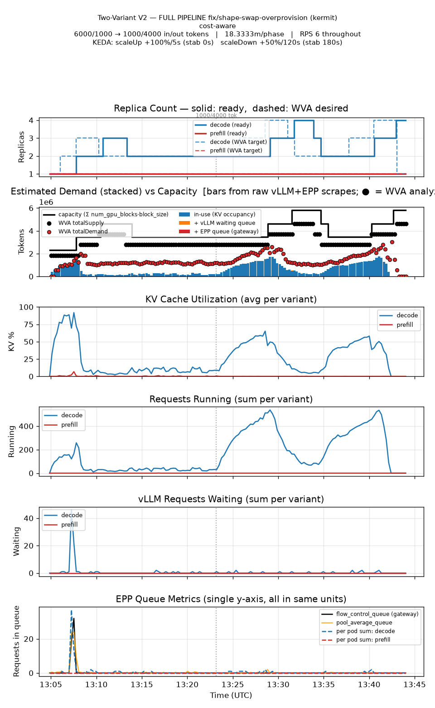

# Scale a P/D-disaggregated model

> **Experimental.** The scenario stands up and runs, WVA's role handling is
> covered end to end, and the shape has a published benchmark (below). What is
> still short: on a shape change within one output-length bucket the fleet
> oscillates by two replicas (named under *Measured*), and there is no
> P/D-specific steady-state e2e spec. Take it as a working recipe with one open
> item, not a settled default.

Prefill and decode have different shapes — prefill is compute-bound, decode is
memory-bandwidth-bound — so llm-d can run them as separate deployments connected
by a KV transport. WVA treats each role as its own variant of the same model,
which means the two are scaled apart on their own evidence rather than together
on an average of both.

**Use it when** you already run P/D disaggregation, or are evaluating it for
long-context workloads on medium-to-large models, and want the roles scaled
independently.

**Do not use it when** you have not measured that a single-role deployment is
the problem. P/D adds a transport dependency and a second deployment to operate;
on short-context traffic it buys little.

## What it needs

- An llm-d P/D deployment: prefill and decode workloads with the role carried on
  each pod template.
- A KV transport between them. NIXL supports TCP, but high-bandwidth networking
  (IB, RoCE, EFA) is what makes the shape worth having.
- A ScaledObject per role, each with the model's `modelID` in trigger metadata.

## Setting it up

The scenario file is
`hack/benchmark/scenarios/guides/pd-disaggregation.yaml`, adapted from llm-d's
own P/D guide, and it is run through [Benchmark WVA](../../guides/benchmarking/).
As written it names Qwen3-32B with one prefill and two decode pods; the
benchmark targets substitute `MODEL_ID` (Qwen3-0.6B by default) and
`BENCHMARK_DECODE_REPLICAS` (1), so a standup starts from one pod per role and
the accelerator profile is auto-detected.

Two pins in that file have to move together. `patch_harness.sh` pins the
modelservice chart to v0.4.15, which renders the routing sidecar's flags as
`--vllm-port/--connector`, and the scenario pins the sidecar to v0.9.0, the
build that takes those flags. Letting either float is how every decode pod
crash-loops on `unknown flag: --connector` at the next standup -- it happened
once, and the file says so.

## Verifying it

```bash
# each role carries its own target
wva_desired_replicas{exported_namespace="<ns>"}

# required capacity is reported per role for a P/D model
wva_required_capacity{exported_namespace="<ns>"}
```

The role appears on the workload's pod template; the engine reports required and
spare capacity per role rather than one number for the pair.

## What it costs

Two deployments to operate instead of one, plus the transport. WVA itself adds
nothing: the roles cost what they would cost anyway.

## How it is benchmarked

**Scenario:** `shape_swap_replay_6k1000_1k4000_rps6_20m` in
`test/benchmark/scenarios/` -- a GuideLLM trace replay at a constant 6 req/s,
6000 in / 1000 out tokens for 1100s and then 1000 in / 4000 out for 1100s.
Rate never changes, so the request shape is the only variable; and 6 req/s is
chosen because one H200 decode replica of Qwen3-0.6B sustains ~5.4 req/s at
the first shape and ~2.5 at the second (measured from the pod's own
completion counters), so the right answer is **two decode replicas, then
three** -- a fleet the autoscaler has to hold up, not one it can let fall to
one. The trace is generated by `hack/benchmark/gen_shape_trace.py` from
`shape_6k1000_1k4000_rps6_20m.params.yaml`; seed 42 makes it identical from
run to run (13,288 requests: 6693 + 6595).

**Stack:** the scenario above, one pod per role to start, `kvCacheThreshold`
0.8, `queueLengthThreshold` 5, `scaleUpThreshold` 0.85, `scaleDownBoundary`
0.7, a 15s optimize interval, KEDA min 1 / max 10 per role, and this HPA
behaviour on both ScaledObjects: scale-up 100%/5s with no stabilization,
scale-down 50%/120s with a 180s window.

### Reproducing it

On a Kubernetes cluster with H200 (or similar) nodes, an RDMA resource the
scenario's `networkResource: auto` can find, and a Prometheus that scrapes
PodMonitors from your namespace:

```bash
export BENCHMARK_NAMESPACE=<ns>
export IMG=<the image under test>          # what is measured is what you set here
export KEDA_HELM_INSTALL=true              # only if the cluster has no KEDA

make benchmark-install
make benchmark-standup BENCHMARK_SPEC=guides/pd-disaggregation MODEL_ID=Qwen/Qwen3-0.6B

# The HPA behaviour the results below were measured under. deploy/ ships a
# 300s scale-down window with a 100% step; this is the tighter shape.
for so in $(kubectl get scaledobject -n $BENCHMARK_NAMESPACE -o name); do
  kubectl patch -n $BENCHMARK_NAMESPACE $so --type merge -p '{"spec":{"advanced":{"horizontalPodAutoscalerConfig":{"behavior":{"scaleDown":{"stabilizationWindowSeconds":180,"policies":[{"type":"Percent","value":50,"periodSeconds":120}]},"scaleUp":{"stabilizationWindowSeconds":0,"policies":[{"type":"Percent","value":100,"periodSeconds":5}]}}}}}}'
done

# The trace has to sit beside the profile: llm-d-benchmark bundles that whole
# directory into the guidellm-profiles ConfigMap (1MiB cap; the trace is 900KB).
cp test/benchmark/scenarios/shape_6k1000_1k4000_rps6_20m.jsonl llm-d-benchmark/workload/profiles/guidellm/

make benchmark-run BENCHMARK_SPEC=guides/pd-disaggregation MODEL_ID=Qwen/Qwen3-0.6B \
     BENCHMARK_HARNESS=guidellm BENCHMARK_WORKLOAD=shape_swap_replay_6k1000_1k4000_rps6_20m

# Graphs, the k1/k2 decision report and the comparison table:
bash hack/benchmark/post_run_analyze.sh <results dir> $BENCHMARK_NAMESPACE

make benchmark-teardown
```

Two things that went wrong on the way and are worth knowing before they cost
an hour. The harness's final `kubectl cp` of the results directory (500MB of
raw scrapes) can die mid-stream with `read message: %!w(<nil>)` and report the
whole run FAILED; the results are still on the workload PVC, and
`kubectl exec <access-to-harness-data pod> -- tar czf` split into 40MB chunks
copies fine. And a cluster whose kueue pod-webhook is unhealthy denies every
Deployment pod with `Deployment.apps ... not found` -- nothing in this recipe
causes it, so check `kubectl create deployment` works in your namespace first.

## Measured

The scenario, trace, policy and HPA behaviour above, on CoreWeave 8 x H200
nodes (k1 = 929,894 tokens per decode replica), against the controller image
built from this tree. Results directory:
`results/guidellm-1789563884-wm9k0y_1` of the 2026-09-16 run; the graphs and
tables are the ones `post_run_analyze.sh` writes.

| | |
|---|---|
| decode replicas over the run | 1 → 2 → 3 → **2 (held through phase 1)** → 3 → 4 → 3 → 2 → 3 → 4 |
| prefill replicas | 1 throughout |
| ready replicas, both roles, mean / max | 3.32 / 5 |
| TTFT p50 / p95 / p99 | 112 ms / 218 ms / 3.1 s |
| ITL p50 / p95 | 12.2 / 21.2 ms |
| request latency p50 / p95 | 17.0 / 80.1 s |
| requests / errors | 13,288 / 0 |
| GPU-minutes (mean replicas x run length) | 90.7 |




How to read it. In the first phase the KV occupancy of the fleet is a fraction
of one replica (the second panel, and 5-15% KV in the third) -- the reading
that, taken alone, would size the fleet to one. The dashed target holds at two
because the analyzer floors each role's demand at what the load requires in
throughput: the arrival rate over the completion rate one replica sustained
when it was last seen saturated (λ/μ = 6.2/4.87 ≈ 1.3 replicas' worth; the
`throughput-demand-floor` line in the controller log carries the terms). Prefill
holds at one because its own occupancy never justifies more and nothing else is
charged to it. The one queue in the run is the 46-request blip at the start
while the second decode replica boots.

What still moves: in the second phase the fleet goes 2 → 3 → 4 → 2 → 3 → 4.
Both shapes share the `long` output-length bucket that keys the learned
throughput, so the floor keeps holding the first shape's two replicas while
the second needs three; occupancy then climbs, the arrival floor over-corrects
to four, and the 50%/120s scale-down takes it back to two in one step. The fix
is a finer key for μ; until it lands, expect that amplitude on a shape change
within one bucket. The p50 ITL is what two replicas at a high batch cost; the
p95 tail is what holding them buys.

The measurement that motivated the throughput floor, and the run it was
compared against, are in [Sizing a backlog](../../proposals/backlog-sizing.md);
the mechanism is in [the demand floors](../../developer-guide/saturation-demand-floor.md).

## How it is tested

End-to-end: `test/e2e/scale_from_zero_pd_test.go` — three specs, checking that
the P/D role is carried on each workload's pod template, that a queued request
wakes the **decode** variant, and that prefill is **never woken alone**.

That is scale-from-zero behaviour for the P/D shape. Steady-state scaling of a
P/D model rides on [the saturation path](../scale-on-saturation/) and its suites;
there is no P/D-specific steady-state spec. The unit specs that hold the
benchmark's behaviour in place are in
`internal/engines/analyzers/saturation_v2/` (`throughput_floor_test.go`, and
the P/D cases in `arrival_demand_test.go` and `analyzer_test.go`), each with a
negative control against the code it replaced.

## Tuning it

Per-role thresholds follow the ordinary policy surface:
[scaling policy](../../reference/scaling-policy.md). What the roles mean to the
engine's capacity model:
[the steady-state engine](../../concepts/steady-state-engine.md).
