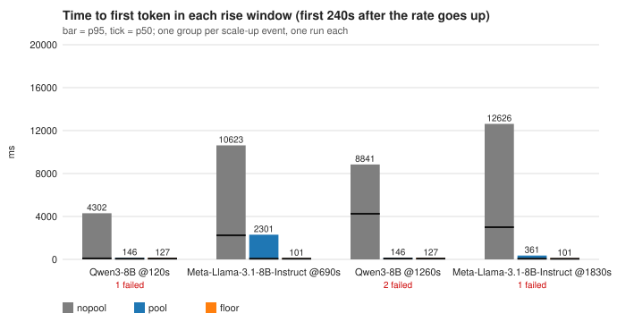
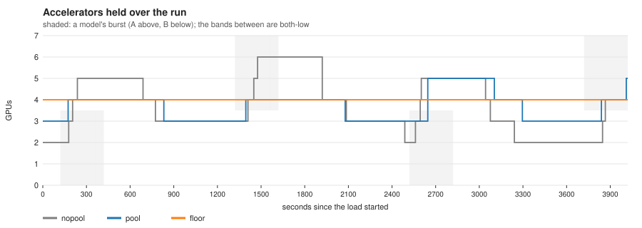

# What a warm pool buys, measured

[← Bridge a scale-up with a warm pool](README.md)

Two models behind one gateway, bursting out of phase, measured three ways with
the same traffic: autoscaling alone (`nopool`), autoscaling with a shared
one-Pod warm pool (`pool`), and no pool but a floor of two replicas per model
(`floor`). Bursts are separated by long quiet stretches, so a held floor is
paid for mostly idle — the shape a pool exists for. One run of each arm, on
CoreWeave H200s, 2026-09-17. The scenario and every guard that keeps the arms
comparable are in the
[benchmarking guide](../../guides/benchmarking/two-model-warm-pool.md); the
numbers below are that report's, unedited.

## The setup

| | |
| --- | --- |
| models | `unsloth/Meta-Llama-3.1-8B-Instruct` (A), `Qwen/Qwen3-8B` (B), one InferencePool + EPP each, 1 × H200 per replica, `max-num-seq 32` |
| load | inference-perf, Poisson open-loop, 1000 in / 500 out tokens, synthetic prompts (no shared prefix — [why that matters](../../guides/benchmarking/two-model-warm-pool.md#the-prompts-share-no-prefix)) |
| rates | each model at 3 rps, bursting to 9 (A) or 8 (B) rps; A and B never burst at once |
| schedule | two minutes at 3 rps, then 300 s bursts separated by 900 s with both models at 3 rps, two cycles; 4020 s and 30 720 requests per arm |
| ceiling | every model 1–4 replicas in every arm; the cluster could place 8 |
| scrape | vLLM metrics every 10 s, models and pool alike ([why](../../guides/warm-pool/operating.md)); the scenario sets it, nothing is patched by hand |
| hand-back | the pool proxy drains before it is cleared (`warmpool-proxy:v11`), so a returning Pod cannot answer `503` in the second before the EPP drops it |

| arm | what it is | the insurance it pays |
| --- | --- | --- |
| `nopool` | autoscaling alone | none — every rise pays a cold model load |
| `pool` | the same, plus a **one-Pod** warm pool (reserve 0) with both models resident | 1 accelerator held for the whole run |
| `floor` | no pool, each model held at **2 or more** replicas | 2 extra replicas held for the whole run |

**Why one Pod.** The two models never burst at once, so at most one scale-up
is in flight at any moment and one warm Pod covers every rise; a second Pod
would sit in reserve for the whole run and double the insurance for nothing.
A pool sized for the number of models that can rise *together* is the rule;
here that number is one.

## Time to first token

Every rise starts from one replica per model, and between bursts the fleet is
back at two GPUs.



| rise | nopool p50 / p95 | pool p50 / p95 | floor p50 / p95 |
| --- | ---: | ---: | ---: |
| Qwen @120 s | 1 133 / 7 287 ms | 71 / 171 ms | 73 / 125 ms |
| Llama @1320 s | 616 / 6 782 ms | 61 / 100 ms | 63 / 101 ms |
| Qwen @2520 s | 1 249 / 12 590 ms | 69 / 933 ms | 77 / 131 ms |
| Llama @3720 s | 67 / 2 530 ms | 59 / 131 ms | 63 / 104 ms |

Whole run p50 / p95 / p99 — Llama: nopool 54 / 3 360 / 6 590, pool 55 / 88 /
125, floor 54 / 89 / 111. Qwen: nopool 63 / 6 506 / 11 556, pool 68 / 120 /
907, floor 64 / 111 / 146. Failures: none, in any arm — 30 720 of 30 720
served three times over.

## Accelerators




| arm | GPU-seconds | of which the pool | lent | peak GPUs | short of its own fleet |
| --- | ---: | ---: | ---: | ---: | ---: |
| nopool | 14 893 | – | – | 6 | 3 % of samples, longest 33 s |
| pool | **14 699** (−1 %) | 4 020 | 513 | 5 | 1 %, longest 20 s |
| floor | 16 080 (+8 %) | – | – | 4 | never |

The pool's accelerator is charged for the whole run, lent or idle — that is
the 4 020 — so the pool arm's models themselves spent 10 679 GPU-s against
nopool's 14 893: the bridge lets every scale-up be smaller and shorter.

## Reading it

**The pool does what it claims.** Every rise goes from 2.5–12.6 s at p95 to
0.1–0.9 s — within 30 ms of the floor on two of the four rises — and the
models' own replica-seconds fall by 28 %, because the bridge lets each
scale-up be smaller and shorter. That is visible as nopool's cost: every cold
rise drives the autoscaler to three or four replicas and holds them through
the 300 s scale-down window, so autoscaling alone averages 3.7 GPUs where the
pool arm's models average 2.7.

**It is cheaper than the floor it replaces.** The floor never scales and
never overshoots, so it serves every rise at ~100 ms for exactly 4 GPUs ×
4020 s; the pool serves the same rises within tens of milliseconds of it for
**9 % less**, and about what autoscaling alone costs (−1 %, which is inside
one run's spread — this page does not claim a sign for that comparison).

**The arithmetic behind the 9 %.** Two models and a one-Pod pool hold
2 + 1 = 3 accelerators in the quiet, against a floor's 4, so the pool's
advantage over the floor caps at 25 % as the quiet fraction of the run
approaches 1. Each burst keeps a model at two replicas for its own length plus
~300 s of stabilization, so with 300 s bursts and 900 s quiet the quiet
fraction is only about half. Twenty percent needs ≥ 3000 s of quiet per
burst; the lever that reaches 30 % and beyond is more models sharing the same
Pod, not more quiet. Conversely, when one model is always bursting the fleet
never returns to two GPUs and a floor is the cheaper insurance — the pool is
for traffic with quiet in it.

**What is not settled.** Four scale-up events per arm, one run each, no
confidence interval; the direction is consistent across all four rises, the
margins are one run's. The lend follows the scale-up decision, and in the
pool arm's own samples the bridge was first seen lent 21 / 55 / 86 / 99 s
after the four rate steps — the decision waits on a queue-based signal that
cannot move until the engine's sequence slots fill, and that lag, not the
pool, is where the Qwen rise at 2520 s (p95 933 ms against the floor's 131)
comes from. The lever there is the demand signal
([operating guide](../../guides/warm-pool/operating.md)).

## Measure it on your cluster

Everything above comes from one make-target family and runs against any
llm-d install with two models and a shared model cache. The scenario carries
the 10 s scrape, the ceiling and the pool shape come from the variables, and
the controller is whatever `IMG` names (the default is this repository's
`main`):

```bash
export BENCHMARK_NAMESPACE=<your namespace>
export MAX_REPLICAS=4 POOL_REPLICAS=1 POOL_RESERVE=0
export PHASE_SECONDS=300 OVERLAP_SECONDS=900 CYCLES=2
make benchmark-two-model-preflight      # placeable accelerators, one accelerator kind
make benchmark-two-model-standup        # both stacks, one gateway
make benchmark-two-model-verify
make benchmark-two-model-reset && make benchmark-two-model-run ARM=nopool
make benchmark-two-model-reset && make benchmark-two-model-run ARM=floor
make benchmark-two-model-pool-create && make benchmark-two-model-warm
make benchmark-two-model-reset && make benchmark-two-model-run ARM=pool
make benchmark-two-model-pool-delete
make benchmark-two-model-report         # report.md, report.json, the three SVGs
make benchmark-two-model-teardown
```

The report refuses rather than tabulates when the arms are not comparable —
different ceilings, unissued arrivals, a driver that queued, a router that
pinned a model to one engine, a sampled series with holes — and the plots are
drawn from `report.json` by `hack/benchmark/two_model_plots.py` with nothing
but the Python standard library, so they regenerate anywhere. Change the
models, rates and shape with the variables listed in the
[benchmarking guide](../../guides/benchmarking/two-model-warm-pool.md#running-it),
and re-measure both ends of the burst when you do.
