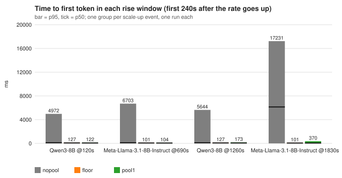
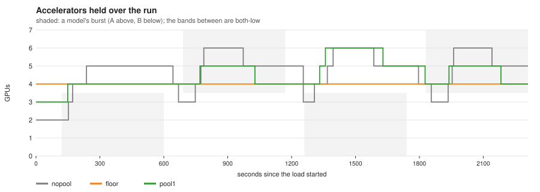
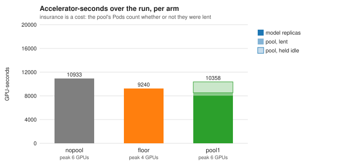
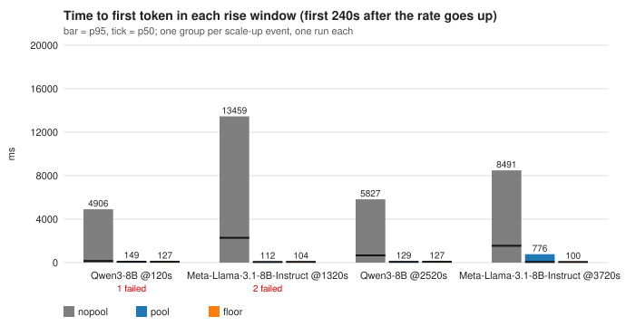
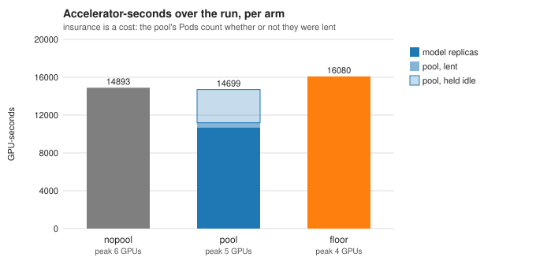

# What a warm pool buys, measured

[← Bridge a scale-up with a warm pool](README.md)

Two models behind one gateway, bursting out of phase, measured three ways with
the same traffic: autoscaling alone (`nopool`), autoscaling with a shared
one-Pod warm pool (`pool`), and no pool but a floor of two replicas per model
(`floor`). Two traffic shapes: **dense** bursts, where one model is always
bursting, and **sparse** bursts separated by long quiet stretches, where a
held floor is paid for mostly idle. One run of each arm, on CoreWeave H200s:
dense on 2026-09-16, sparse on 2026-09-17 with the hand-back fix and the
pool's own 10 s scrape in (the earlier sparse run is kept below as the repeat).
The scenario and every guard that keeps the arms comparable are in the
[benchmarking guide](../../guides/benchmarking/two-model-warm-pool.md); the
numbers below are that report's, unedited.

## The setup

| | |
| --- | --- |
| models | `unsloth/Meta-Llama-3.1-8B-Instruct` (A), `Qwen/Qwen3-8B` (B), one InferencePool + EPP each, 1 × H200 per replica, `max-num-seq 32` |
| load | inference-perf, Poisson open-loop, 1000 in / 500 out tokens, synthetic prompts (no shared prefix — [why that matters](../../guides/benchmarking/two-model-warm-pool.md#the-prompts-share-no-prefix)) |
| rates | each model at 3 rps, bursting to 9 (A) or 8 (B) rps; A and B never burst at once |
| ceiling | every model 1–4 replicas in every arm; the cluster could place 8 |
| scrape | vLLM metrics every 10 s, models and pool alike ([why](../../guides/warm-pool/operating.md)); the scenario sets it, nothing is patched by hand |
| hand-back | the pool proxy drains before it is cleared (`warmpool-proxy:v11`), so a returning Pod cannot answer `503` in the second before the EPP drops it |

| arm | what it is | the insurance it pays |
| --- | --- | --- |
| `nopool` | autoscaling alone | none — every rise pays a cold model load |
| `pool` | the same, plus a **one-Pod** warm pool (reserve 0) with both models resident | 1 accelerator held for the whole run |
| `floor` | no pool, each model held at **2 or more** replicas | 2 extra replicas held for the whole run |

**Why one Pod.** A two-Pod pool with the default reserve of one was run first
(2026-09-16, 30 s scrape). Its own log showed `lent` never above **1** for the
whole run: the second Pod was reserve throughout, and the pool held 4 620 GPU-s
to lend 525. With anti-phase bursts one Pod does the same work at half the
cost, so that is the pool measured here; the two-Pod run is kept in the
results directory as `three-arms/`.

## Dense bursts: one model is always bursting

Two minutes at 3 rps each, then four 8-minute phases in which A and B take
turns bursting, with 90 s both-low bands between; 2310 s in all, 24 420
requests per arm. The falling model still holds its replicas when the other
rises, so the fleet never returns to two GPUs.



| rise | nopool p50 / p95 | pool p50 / p95 | floor p50 / p95 |
| --- | ---: | ---: | ---: |
| Qwen @120 s | 107 / 4 972 ms | 67 / 122 ms | 74 / 127 ms |
| Llama @690 s | 100 / 6 703 ms | 62 / 104 ms | 63 / 101 ms |
| Qwen @1260 s | 97 / 5 644 ms | 67 / 173 ms | 76 / 127 ms |
| Llama @1830 s | 6 143 / 17 231 ms | 62 / 370 ms | 62 / 101 ms |

Whole run p50 / p95 / p99 — Llama: nopool 59 / 10 037 / 16 909, pool 61 / 100
/ 401, floor 60 / 96 / 123. Qwen: nopool 69 / 3 966 / 5 644, pool 66 / 120 /
175, floor 67 / 119 / 152. Failures: none in any arm.





| arm | GPU-seconds | of which the pool | lent | peak GPUs | short of its own fleet |
| --- | ---: | ---: | ---: | ---: | ---: |
| nopool | 10 933 | – | – | 6 | 5 % of samples, longest 20 s |
| pool | 10 358 (−5 %) | 2 310 | 467 | 6 | 2 %, longest 14 s |
| floor | **9 240** (−15 %) | – | – | 4 | never |

## Sparse bursts: long quiet stretches between them

Two minutes at 3 rps, then 300 s bursts separated by 900 s with both models at
3 rps, two cycles; 4020 s in all, 30 720 requests per arm. Every rise starts
from one replica per model, and between bursts the fleet is back at two GPUs.



| rise | nopool p50 / p95 | pool p50 / p95 | floor p50 / p95 |
| --- | ---: | ---: | ---: |
| Qwen @120 s | 1 133 / 7 287 ms | 71 / 171 ms | 73 / 125 ms |
| Llama @1320 s | 616 / 6 782 ms | 61 / 100 ms | 63 / 101 ms |
| Qwen @2520 s | 1 249 / 12 590 ms | 69 / 933 ms | 77 / 131 ms |
| Llama @3720 s | 67 / 2 530 ms | 59 / 131 ms | 63 / 104 ms |

Whole run p50 / p95 / p99 — Llama: nopool 54 / 3 360 / 6 590, pool 55 / 88 /
125, floor 54 / 89 / 111. Qwen: nopool 63 / 6 506 / 11 556, pool 68 / 120 /
907, floor 64 / 111 / 146. Failures: none, in any arm — 30 720 of 30 720
served three times over.




| arm | GPU-seconds | of which the pool | lent | peak GPUs | short of its own fleet |
| --- | ---: | ---: | ---: | ---: | ---: |
| nopool | 14 893 | – | – | 6 | 3 % of samples, longest 33 s |
| pool | **14 699** (−1 %) | 4 020 | 513 | 5 | 1 %, longest 20 s |
| floor | 16 080 (+8 %) | – | – | 4 | never |

The pool's accelerator is charged for the whole run, lent or idle — that is
the 4 020 — so the pool arm's models themselves spent 10 679 GPU-s against
nopool's 14 893: the bridge lets every scale-up be smaller and shorter.

**The repeat.** The same shape was run once before (2026-09-17, before the
hand-back fix, pool PodMonitor at 30 s): nopool 13 489, pool 14 446, floor
16 080; pool rises 112–776 ms, and 3 `503`s at hand-back. Between the two
runs the floor did not move (it never scales, so its cost is 4 × 4020 s
exactly), the pool moved 2 %, and nopool moved 10 % — the arm with nothing
held is the one whose cost depends on when each scale-down lands against
the 300 s stabilization window. So the readings that held across both runs
are the ones to keep: the pool costs **9–10 % less than the floor** for rises
the floor barely beats, and its rises are two orders below nopool's. Whether
the pool costs a little more or a little less than autoscaling alone (+7 %
then −1 %) is inside one run's spread, and this page does not claim a sign
for it.

## Reading it

**The pool does what it claims, in both shapes.** Every rise goes from 2.5–17 s
at p95 to 0.1–0.9 s — within 30 ms of the floor on four of the eight rises
and within 50 ms on six —
and the models' own replica-seconds fall in both shapes, because the bridge
lets each scale-up be smaller and shorter. In the sparse shape that is
visible as nopool's cost: every cold rise drives the autoscaler to three or
four replicas and holds them through the 300 s scale-down window, so
autoscaling alone averages 3.7 GPUs where the pool arm's models average 2.7.

**Whether it is worth its Pod depends on the traffic shape.** With dense
bursts the fleet never returns to two GPUs, so a floor of two replicas per
model costs *less* than either alternative (it never scales, and it never
overshoots) while serving every rise at ~100 ms — the pool is the wrong
insurance there. With quiet stretches the ordering is the one the pool exists
for: it costs 9–10 % less than the floor, for rises the floor barely beats,
and about what autoscaling alone costs (see the repeat above).

**The arithmetic behind the 10 %.** Two models and a one-Pod pool hold
2 + 1 = 3 accelerators in the quiet, against a floor's 4, so the pool's
advantage over the floor caps at 25 % as the quiet fraction of the run
approaches 1. Each burst keeps a model at two replicas for its own length plus
~300 s of stabilization, so with 300 s bursts and 900 s quiet the quiet
fraction is only about half. Twenty percent needs ≥ 3000 s of quiet per burst; the
lever that reaches 30 % and beyond is more models sharing the same Pod, not
more quiet.

**What is not settled.** Four scale-up events per arm, one run each of the
dense shape and two of the sparse, no confidence interval; the direction is
consistent across all eight rises and both shapes, and the sparse repeat says
which margins survive a re-run (above). The pool arm's `503`s in the earlier
runs (3 in the first sparse run, 4 in the two-Pod run) were the pool proxy
answering `no model is awake in this Pod` during the ~1.6 s between a
bridge's proxy being cleared at hand-back and the EPP dropping the Pod; the
proxy now drains before it is cleared, and the sparse run above is the first
with that in — 0 failures across 92 160 requests.

**The decision lag is the signal, not the controller.** From each rate step
to the scale-up decision (which is also what triggers the lend): 25 / 56 / 56
/ 87 s at a 30 s scrape, 15 / 60 / 60 / 76 s at 10 s. The controller acts
within ~7 s of Prometheus holding the sample; the rest is the queue-based
demand signal, which cannot move until the engine's 32 sequence slots are
full. A leading signal — arrival rate on a shorter window, or slot occupancy —
is the next lever, and a controller change.

## Measure it on your cluster

Everything above comes from one make-target family and runs against any
llm-d install with two models and a shared model cache. The scenario carries
the 10 s scrape, the ceiling and the pool shape come from the variables, and
the controller is whatever `IMG` names (the default is this repository's
`main`; the sparse run above was `main` at #63/#64/#66/#68 with the
benchmark branch on top):

```bash
export BENCHMARK_NAMESPACE=<your namespace>
export MAX_REPLICAS=4 POOL_REPLICAS=1 POOL_RESERVE=0
make benchmark-two-model-preflight      # placeable accelerators, one accelerator kind
make benchmark-two-model-standup        # both stacks, one gateway
make benchmark-two-model-verify
make benchmark-two-model-reset && make benchmark-two-model-run ARM=nopool
make benchmark-two-model-reset && make benchmark-two-model-run ARM=floor
make benchmark-two-model-pool-create && make benchmark-two-model-warm
make benchmark-two-model-reset && make benchmark-two-model-run ARM=pool
make benchmark-two-model-pool-delete
make benchmark-two-model-report         # report.md, report.json, the three SVGs
make benchmark-two-model-teardown
```

The dense shape is the default; the sparse one is `PHASE_SECONDS=300
OVERLAP_SECONDS=900 CYCLES=2`. The report refuses rather than tabulates when
the arms are not comparable — different ceilings, unissued arrivals, a driver
that queued, a router that pinned a model to one engine, a sampled series with
holes — and the plots are drawn from `report.json` by
`hack/benchmark/two_model_plots.py` with nothing but the Python standard
library, so they regenerate anywhere. Change the models, rates and shape with
the variables listed in the
[benchmarking guide](../../guides/benchmarking/two-model-warm-pool.md#running-it),
and re-measure both ends of the burst when you do.
